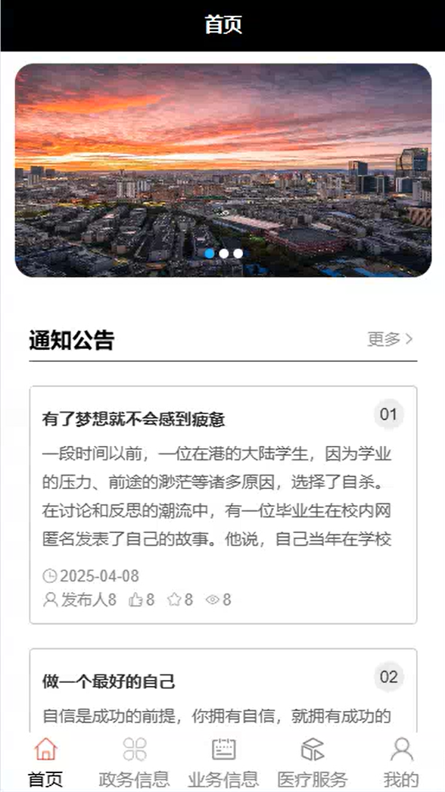
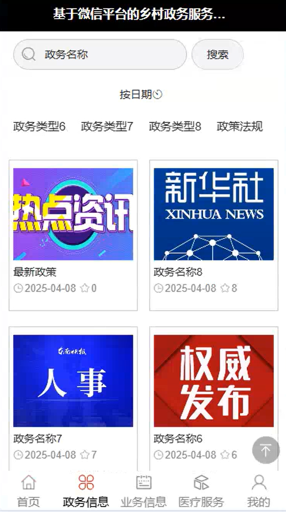
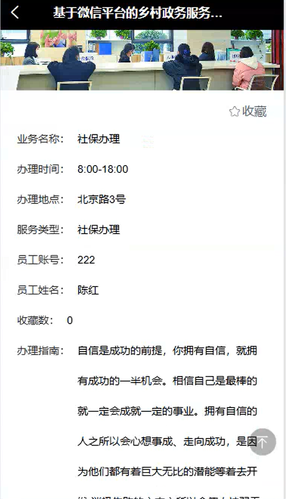
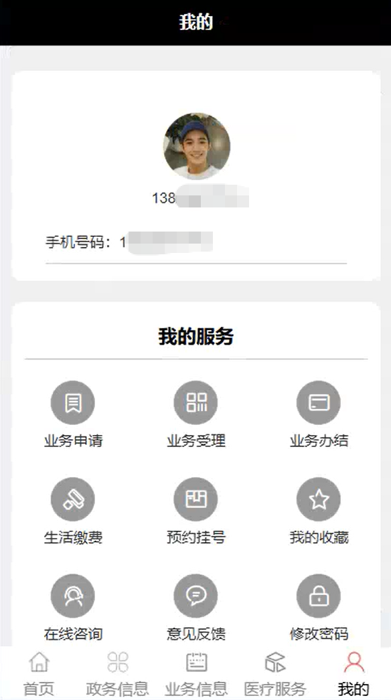
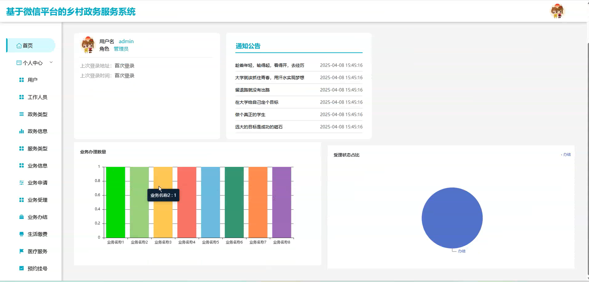
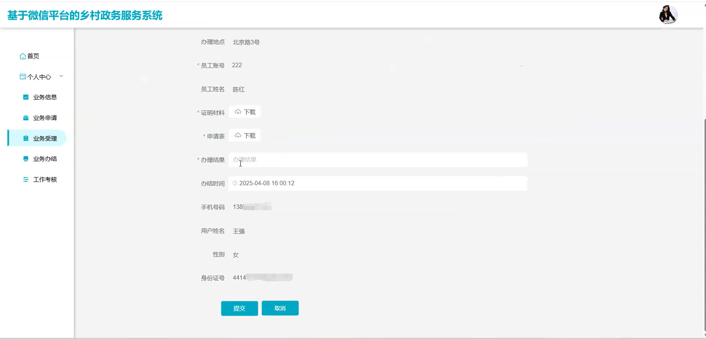
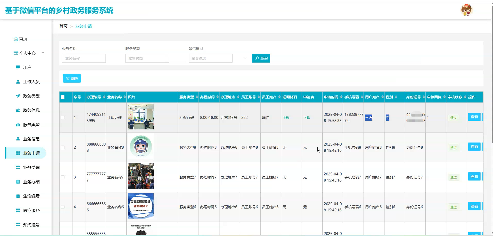
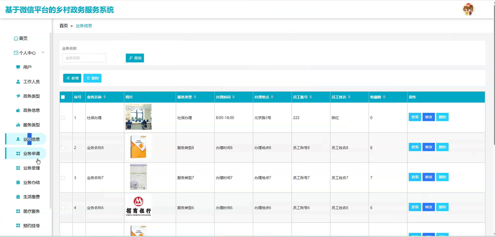

# mpweixinA218D
mpweixinA218D乡村政务服务微信小程序
 
## 源码问题查看主页咨询

### 一、关键词
业务信息，业务办结，政务信息

### 二、作品包含
源码+数据库+全套环境和工具资源+本地部署教程

### 三、项目技术
前端技术： Html、Css、Js、Vue2.0、Element-ui、uniapp
后端技术：Java、SpringBoot2.0、MyBatis

### 四、运行环境（以下版本亲测，其他版本兼容性请自行测试）
开发工具：IDEA/eclipse  + VSCODE + 微信开发者工具 + HBuilder X

数据库：MySQL5.7（最低要5.7版本）

数据库管理工具：Navicat10以上版本

环境配置软件： JDK1.8 + Maven3.6.3

前端Nodejs：14

浏览器：谷歌浏览器

### 五、项目介绍
项目编号：mpweixinA218D

乡村政务服务微信小程序预约挂号等便民服务，还能减轻基层干部工作负担，提升乡村治理效能。

角色：管理员、用户、工作人员

管理员：首页、个人中心、用户、工作人员、政务类型、政务信息、服务类型、业务信息、业务申请、业务受理、业务办结、生活缴费、医疗服务、预约挂号、工作考核、意见反馈、系统管理。

用户：首页、政务信息、业务信息、医疗服务、我的、业务申请、业务受理、业务办结、生活缴费、预约挂号、我的收藏、在线咨询、意见反馈、修改密码。

工作人员：首页、个人中心、业务信息、业务申请、业务受理、业务办结、工作考核。

### 六、运行截图

